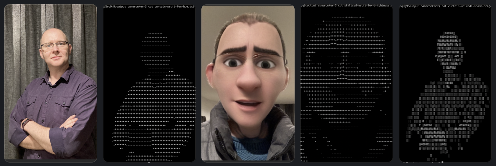

# Nerdascii :: ASCII Art from Photos with Backgrounds Removed

```bash
docker run --rm \
    -v $PWD/input:/input \
    -v $PWD/output:/output \
    nerdascii:latest \
    /input/input.jpg '/output/output-{palette}-{method}.txt' \
    ascii-few:hue ascii-few:brightness
```

Note you need to bind-mount the input directory (or file), and bind-mount the output *directory*; multiple output files will be produced depending on the mode provided, with `{palette}` and `{method}` being replaced by each palette (eg. `ascii-few`) and method (eg. `hue` or `brightness`)

There are some samples distributed in the container image:

```bash
docker run --rm \
    -v $PWD/output:/output \
    nerdascii:latest \
    /samples/curtain.jpg /output/curtain-{palette}-{method}.txt \
    ascii-few:hue ascii-few:brightness
```



## Palette and Method

Palettes are the set of characters that make up the characters used to paint the picture. The first character is what gets assigned to be the background, so this is typically the space character.

Method is the manner by which we project some detail of the image (typically its brightness or its colour) which then determins which character in the palette is used.

Palettes:
- ascii-few
- ascii-several
- unicode-coloured-dots -- why? because I can, not because it looks good
- unicode-shade -- its like a modern retake on the glory days of DOS

Methods:
- brightness
- hue

## What's the significance of this project?

There are a few aims:
- Show a few iterations on building a fun container image
- Show off some cool machine-learning technology that introduces a bunch of dependencies we need to package
- Invite people to have a bit of fun with Python
